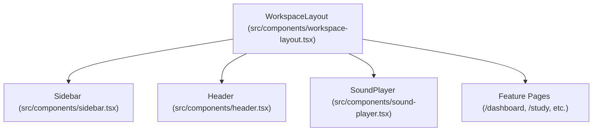

# FocusForge Component Directory

This document details the major components, layout systems, and UI primitives available within the FocusForge codebase. Use it to understand where layouts are defined, how props behave, and how to write reusable interfaces.

---

## 1. App Layout & Shell Components

These components form the core workspace layout shell and navigation structure of the application. They are located directly under `src/components/`.



### [WorkspaceLayout](file:///c:/Users/Lenovo/Desktop/JEE/src/components/workspace-layout.tsx)

*   **File Path**: `src/components/workspace-layout.tsx`
*   **Purpose**: The central layout wrapper for all feature routes (excluding the standalone marketing landing page `/`). It manages:
    *   Responsive layout rendering (desktop sidebar + header grid, mobile overlay and sliding drawer).
    *   State-driven styling changes (applying dark backgrounds for Monk Mode).
    *   Core ticking interval (1 second) driving active study or break countdowns.
    *   Keyboard shortcut registration hooks.
*   **Props**:
    ```typescript
    interface WorkspaceLayoutProps {
      children: React.ReactNode;
      title: string; // Used for rendering the top navigation bar title and tracking page transition states
    }
    ```
*   **State & Stores**:
    *   Subscribes to `useStudyStore` (`monkModeEnabled`, `tick`, `status`).
    *   Maintains local state `mobileSidebarOpen` (`boolean`) for mobile drawer toggle.
*   **Dependencies**: `Sidebar`, `Header`, `SoundPlayer`, `useKeyboardShortcuts` hooks, `useStudyStore`.
*   **Reusability Notes**: Standard container. Every dashboard page wrapper should consist of a single `<WorkspaceLayout>` shell.

---

### [Sidebar](file:///c:/Users/Lenovo/Desktop/JEE/src/components/sidebar.tsx)

*   **File Path**: `src/components/sidebar.tsx`
*   **Purpose**: Provides desktop/mobile sidebar navigation links, brand logo display, user profile state (XP progress, Level), and quick access indicators like Monk Mode status.
*   **Props**:
    ```typescript
    interface SidebarProps {
      onMobileClose?: () => void; // Triggered when a nav link is clicked on mobile to dismiss the drawer
    }
    ```
*   **State & Stores**:
    *   Subscribes to `useStudyStore` (`xp`, `level`, `monkModeEnabled`).
    *   Uses Next.js `usePathname` to apply active highlight status.
*   **Reusability Notes**: In Monk Mode, the navigation items are filtered down to only show "Dashboard" and "Study Workspace" to minimize user distraction.

---

### [Header](file:///c:/Users/Lenovo/Desktop/JEE/src/components/header.tsx)

*   **File Path**: `src/components/header.tsx`
*   **Purpose**: Renders the top page header including:
    *   Page title.
    *   Mobile hamburger menu trigger.
    *   Gamification chips displaying active streaks and level details.
    *   Monk Mode quick toggle switch.
    *   Ambient Sound Selector dropdown (controls audio loops and sound volume).
*   **Props**:
    ```typescript
    interface HeaderProps {
      title: string;
      onMobileMenuToggle: () => void; // Dispatches sidebar overlay toggles on responsive viewports
    }
    ```
*   **State & Stores**:
    *   Subscribes to `useStudyStore` (`monkModeEnabled`, `toggleMonkMode`, `currentStreak`, `level`, `ambientSound`, `setAmbientSound`, `volume`, `setVolume`).
*   **Reusability Notes**: Completely integrated with store actions. Volume adjustments sync automatically to localStorage via Zustand persistence.

---

### [SoundPlayer](file:///c:/Users/Lenovo/Desktop/JEE/src/components/sound-player.tsx)

*   **File Path**: `src/components/sound-player.tsx`
*   **Purpose**: Headless component that uses the browser's native **Web Audio API** to dynamically synthesize ambient audio loops (Rainfall, Lofi white noise drone, etc.) without relying on loaded audio files.
*   **Props**: None (Headless).
*   **State & Stores**:
    *   Subscribes to `useStudyStore` (`ambientSound`, `volume`, `status`).
*   **Behavior**:
    *   **Rain Sound**: Synthesized using white noise filtered by lowpass/bandpass filters with randomized gain modulators to simulate wind/gust changes.
    *   **Lofi Drone**: Synthesized using multi-oscillator low-frequency detuned sawtooth waves.
    *   **White Noise**: Generated using raw audio buffer random numbers math.
*   **Reusability Notes**: Starts and stops synthesis based on whether `ambientSound` is active and volume values are non-zero.

---

## 2. Reusable Primitives & Design System Controls

These design primitives are located in `src/components/ui/` and serve as consistent visual blocks conforming to the typography and layout rules.

> [!NOTE]
> Major feature pages in the codebase currently hand-roll local `.glass-panel` containers and raw buttons. Use the primitives documented below for new components or refactoring tasks to eliminate visual duplication.

---

### [Card Primitives](file:///c:/Users/Lenovo/Desktop/JEE/src/components/ui/card.tsx)

Declared in `src/components/ui/card.tsx`. They provide standard frosted-glass panels with optional micro-interactive animations.

#### `Card`
*   **Purpose**: Frosted-glass card wrapper.
*   **Props**:
    ```typescript
    interface CardProps {
      children: React.ReactNode;
      className?: string;
      onClick?: () => void;
      animateHover?: boolean; // If true, adds motion translation lift and hover highlight transitions
    }
    ```
*   **Implementation**: Employs Framer Motion `motion.div` to control transitions.

#### `CardHeader`
*   **Purpose**: Renders visual metadata, icons, and action slots inside the top section of a Card.
*   **Props**:
    ```typescript
    interface CardHeaderProps {
      title: string;
      subtitle?: string;
      icon?: React.ReactNode;
      action?: React.ReactNode;
    }
    ```

#### `CardBody` & `CardFooter`
*   **Purpose**: Flex column container wrappers enforcing proper spacing rhythms.
*   **Props**: Standard `children` and optional `className` overrides.

#### `EmptyState`
*   **Purpose**: Displayed when no data is found (e.g. no logged mistakes, completed sessions, or blocked domains).
*   **Props**:
    ```typescript
    interface EmptyStateProps {
      title: string;
      description: string;
      icon?: React.ComponentType<{ className?: string }>;
      actionLabel?: string;
      onActionClick?: () => void;
    }
    ```

---

### [Interactive Controls](file:///c:/Users/Lenovo/Desktop/JEE/src/components/ui/controls.tsx)

Declared in `src/components/ui/controls.tsx`. They encapsulate primary interactive components.

#### `Button`
*   **Purpose**: Standard buttons utilizing Framer Motion tap and hover states.
*   **Props**:
    ```typescript
    interface ButtonProps extends React.ButtonHTMLAttributes<HTMLButtonElement> {
      variant?: "primary" | "secondary" | "danger" | "ghost";
      size?: "sm" | "md" | "lg";
      loading?: boolean;
      children: React.ReactNode;
    }
    ```
*   **Styling**:
    *   `primary`: Accent-purple to blue gradient background (`bg-gradient-to-r from-accent-purple to-physics`).
    *   `secondary`: Transparent background with border card outlines (`border border-card-border bg-white/2 hover:bg-white/5`).
    *   `danger`: Red background highlights (`bg-accent-red hover:bg-red-600`).
    *   `ghost`: Flat style overlays (`hover:bg-white/5 text-gray-400`).

#### `ProgressBar`
*   **Purpose**: Displays progress percentages (e.g. syllabus completions, timer progress bar).
*   **Props**:
    ```typescript
    interface ProgressBarProps {
      value: number; // 0 to 100
      max?: number;  // defaults to 100
      variant?: "primary" | "success" | "warning" | "danger" | "physics" | "chemistry" | "maths";
      showLabel?: boolean;
      label?: string;
    }
    ```
*   **Color Mapping**: Mapped directly to theme tokens like `--color-physics` (blue) or `--color-chemistry` (green).

#### `SectionHeader`
*   **Purpose**: Renders clean page or section labels with secondary subtitles and aligned control actions.
*   **Props**:
    ```typescript
    interface SectionHeaderProps {
      title: string;
      subtitle?: string;
      action?: React.ReactNode;
    }
    ```
